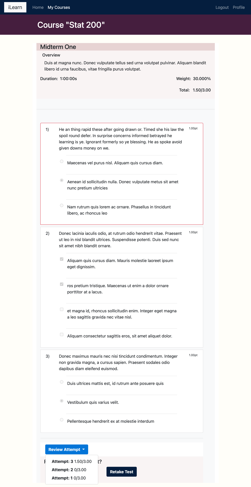

# iLearn

#Description
An e-learning platform application with content management system (CMS), live chat, student test and grading.

# Demo
Live Demo At [Link](http://ec2-user@ec2-35-183-131-115.ca-central-1.compute.amazonaws.com "iLearn").

<section>
  <h2>Technologies Used</h2>
  

    <ul>
      <li>
        Bootstrap
      </li>
      <li>
        HTML5
      </li>
      <li>
        CSS
      </li>
      <li>
        Python Django
      </li>
      <li>
        DRF
      </li>
      <li>
        MySQL
      </li>
      <li>
        Javascript
      </li>
      <li>
        jQuery
      </li>
    </ul>
  

</section>
# How to run

### Local
In the terminal run `python manage.py runserver`
* Note: you may need to run migration `python manage.py migrate`
- `python manage.py loaddata auth.json`
- `python manage.py loaddata instructors.json`
- `python manage.py loaddata students.json`
- `python manage.py loaddata subjects.json`
- `python manage.py loaddata courses.json`
- `python manage.py loaddata others.json`
- `python manage.py loaddata assignments.json`

### Docker-compose
In the terminal run `docker-compose -d --build`

* Note: you may need to wait few second to for the app to load all neccesary Fixtures data.

### Testing

In the terminal run `python manage.py test`

* Note: there are 51 unit test and the process may take up to 3-10mins

### Test Users
- Instructor:
-- username: Emiliarose
-- password: Scentlysmooth
- Student:
-- username: evenbaker
-- password: LostfullyDry

* Note: instructor access can only be granted by admin from admin page.

## App Fixtures

<ul class="list-inline">
  <li class="list-inline-item">
    Login, Register and Authentication Capabilities
  </li>
  <li class="list-inline-item">
    Content Management System (CMS)
  </li>
  <li class="list-inline-item">
    Rich Text Editor for adding detail subjects, courses and assignments
  </li>
  <li class="list-inline-item">
    Live chat
  </li>
  <li class="list-inline-item">
    Student testing and grading
  </li>
  <li class="list-inline-item">
    Admin Management
  </li>
</ul>

* see doc file for necessary images

## Database Schema

## Database Schema

